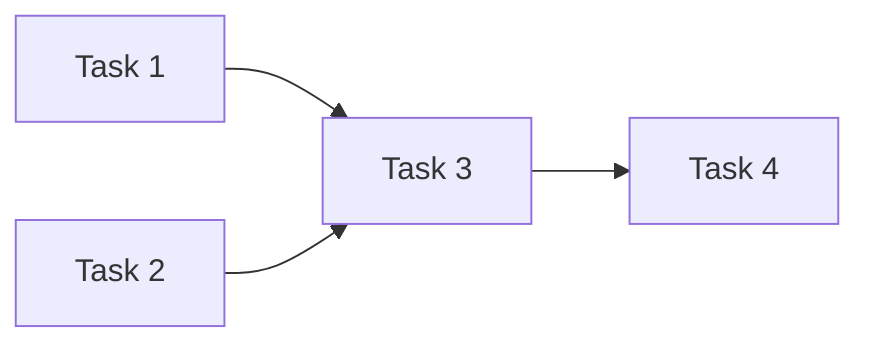

# {Feature Name} — Implementation Plan

> **For agents:** Follow phases in dependency order. Parallel lanes may run concurrently only where noted.  
> **Spec:** [link to spec file]  
> **Status:** Draft | Approved

## Goal

{One sentence}

## Architecture

{2–4 sentences: approach, reuse of existing modules, what stays unchanged}

## Dependency graph

| Lane | Tasks | Can run in parallel with |
|------|-------|--------------------------|
| A | {tasks} | Lane B after {gate} |
| B | {tasks} | — |

## Reuse checklist (anti-bloat)

- [ ] Searched for existing {service, helper, pattern} before adding new abstraction
- [ ] Extends {named module} rather than duplicating logic
- [ ] No new dependency unless justified in spec

---

## Task 1: {Name}

**Files:**
- Modify: `{path}`
- Test: `{path}`

**Depends on:** none | Task N  
**Parallel with:** Task M (if independent)

- [ ] Step 1: …
- [ ] Step 2: …

**Verify:** `{exact test command from AGENTS.md}`

---

## Task N: {Name}

{Repeat structure}

---

## Verification (pre-PR)

| Check | Command / action |
|-------|------------------|
| Unit tests | `{command}` |
| Lint | `{command}` |
| Smoke | See smoke checklist |

## Doc updates required

- [ ] {AGENTS.md / rule / context file}
