# SDLC skills reference (human only)

Quick map of which skills drive each SDLC phase. **Authoritative source for the agent:** [.cursor/rules/feature-sdlc.mdc](../.cursor/rules/feature-sdlc.mdc). This file is not auto-loaded into agent context.

## Source legend

| Tag | Origin |
|-----|--------|
| **PROJ** | Project-authored (`.cursor/skills/`) |
| **ACS** | [awesome-cursor-skills](https://github.com/spencerpauly/awesome-cursor-skills) (vendored) |
| **SP** | [Superpowers](https://github.com/obra/superpowers) (vendored + adapted) |

Provenance and refresh notes: [.cursor/skills/ATTRIBUTION.md](../.cursor/skills/ATTRIBUTION.md).

## Phase flow (diagram)

Primary skills appear first in each box; support skills follow. View on **GitHub** or in an editor with Mermaid preview; if the diagram shows as text, use the [per-phase list](#per-phase-list-text-fallback) below.

```mermaid
flowchart TD
  subgraph crosscut ["Cross-cutting (apply in any phase)"]
    direction LR
    c1["systematic-debugging · SP"]
    c2["verification-before-completion · SP"]
    c3["using-git-worktrees · SP"]
    c4["saving-workspace-context · PROJ"]
    c1 --- c2 --- c3 --- c4
  end

  subgraph phase1 ["Phase 1 Spec"]
    p1["Primary · project-feature-sdlc · PROJ"]
    s1["Support · brainstorming · SP"]
    p1 --> s1
  end

  subgraph phase2 ["Phase 2 Plan"]
    p2["Primary · writing-plans · SP"]
    s2["Support · parallel-exploring · ACS"]
    p2 --> s2
  end

  subgraph phase3 ["Phase 3 TDD"]
    p3["Primary · test-driven-development · SP"]
    s3["Support · writing-tests · ACS"]
    p3 --> s3
  end

  subgraph phase4 ["Phase 4 Execute"]
    p4a["Primary · subagent-driven-development · SP"]
    p4b["Alt primary · grinding-until-pass · ACS"]
    s4["Support · finding-dev-server-url · ACS"]
    p4a --> p4b --> s4
  end

  subgraph phase5 ["Phase 5 Smoke"]
    p5a["Primary · api-smoke-testing · ACS"]
    p5b["Primary · verifying-in-browser · ACS"]
    s5a["Support · finding-dev-server-url · ACS"]
    s5b["Support · visual-qa-testing · ACS"]
    s5c["Support · recording-browser-flow-as-test · ACS"]
    s5d["Support · screenshotting-changelog · ACS"]
    p5a --> p5b --> s5a --> s5b --> s5c --> s5d
  end

  subgraph phase6 ["Phase 6 Review"]
    p6["Primary · parallel-code-review · ACS"]
    s6["Support · auditing-security · ACS"]
    p6 --> s6
  end

  subgraph phase7 ["Phase 7 PR"]
    p7a["Primary · creating-pr · ACS"]
    p7b["Primary · writing-commit-messages · ACS"]
    s7a["Support · babysitting-pr · ACS"]
    s7b["Support · parallel-ci-triage · ACS"]
    s7c["Support · screenshotting-changelog · ACS"]
    p7a --> p7b --> s7a --> s7b --> s7c
  end

  subgraph phase8 ["Phase 8 Retro"]
    p8["Primary · saving-workspace-context · PROJ"]
    s8a["Support · building-skills-from-patterns · ACS"]
    s8b["Support · suggesting-cursor-rules · ACS"]
    p8 --> s8a --> s8b
  end

  s1 --> p2
  s2 --> p3
  s3 --> p4a
  s4 --> p5a
  s5d --> p6
  s6 --> p7a
  s7c --> p8

  c4 ~~~ p1
```

The top row holds **cross-cutting** skills that apply in *any* phase (not a sequence — the links just group them). Below it, arrows between phase boxes show SDLC order, and arrows inside each box order primary before support (not separate workflow steps).

## How the skills work together

You rarely invoke these skills by name. The **`feature-sdlc` rule** ([.cursor/rules/feature-sdlc.mdc](../.cursor/rules/feature-sdlc.mdc), always loaded) is the spine: it watches for feature/behavior/multi-file work and tells the agent *which skill to run when*. The skills themselves only describe *how*. This section explains the moving parts so you can trust the system without reading every `SKILL.md`.

### 1. The orchestrator and the phase chain

`project-feature-sdlc` (Phase 1) is the entry point. It walks the eight phases in order and will not advance past a **gate** (approved spec, approved plan, RED test before code, green tests + smoke before "done"). Each phase nominates one **Primary** skill that drives the work and zero or more **Support** skills that kick in only when their trigger applies (e.g. `parallel-exploring` only for large/unfamiliar code). The hand-offs are deliberate: explore → plan → failing test → implement → smoke → review → PR → retro. The arrows in the diagram above are those hand-offs.

### 2. Cross-cutting skills weave through every phase

Four skills aren't tied to a phase:

- **`systematic-debugging`** — the moment anything misbehaves (a failing test, an unexpected response), find root cause before patching.
- **`verification-before-completion`** — before *any* "it works / it's done / it passes" claim, run the command and paste the evidence. This is the gate that keeps every other phase honest.
- **`using-git-worktrees`** — when work needs isolation from the current branch (usually before Phase 4).
- **`saving-workspace-context`** — load `context/` at session start and capture learnings *continuously*; Phase 8 only consolidates them.

### 3. The memory loop (how the system learns)

This is the part that makes the kit improve over time:

1. **`saving-workspace-context`** captures decisions/gotchas to `context/<topic>.md` as you go, and writes a retro to `context/retros/…` at Phase 8.
2. **`building-skills-from-patterns`** mines those persisted notes (and repeated live corrections) for *recurring* patterns, then triages each one: a repeatable **procedure** → a new skill; a **hook**-able guardrail → a script; an always-on **convention** → hand off to…
3. **`suggesting-cursor-rules`**, which authors the `.mdc` rule. It does *not* re-mine context — that division of labor avoids a bloated mega-skill.

All promotions are proposed to you, never applied silently.

### 4. Automation via hooks

Some grinding is automated so the agent can't forget it. The `stop` hook runs [.cursor/hooks/check-tests.sh](../.cursor/hooks/check-tests.sh) (backend `pytest` + frontend `vitest`, each self-skipping if absent) at the end of a turn; on failure it feeds a `followup_message` back in, which is exactly what `grinding-until-pass` reacts to. A `beforeShellExecution` hook blocks commits that still contain debug artifacts. Hooks are the enforcement layer; skills are the guidance layer.

### 5. Why the skills stay generic (and where specifics live)

Skills deliberately avoid baking in a framework, port, or run command, so they don't rot when the stack changes. Instead:

- **Project specifics live in [AGENTS.md](../AGENTS.md)** — the canonical commands (`pytest`, `ruff`, `npm test`, `npm run dev`, `uvicorn …`), ports, and prerequisites. Skills that need a command point there.
- **Runtime URLs/ports are discovered, not assumed** — `finding-dev-server-url` scans the live terminals and reports the actual base URL. The browser/smoke skills (`verifying-in-browser`, `visual-qa-testing`, `api-smoke-testing`, `screenshotting-changelog`) take that URL as input rather than hardcoding `localhost:<port>`.
- **Multi-stack by default** — test/CI/PR skills (`writing-tests`, `grinding-until-pass`, `creating-pr`, `babysitting-pr`, `parallel-ci-triage`) detect or address both the Python backend and the React frontend instead of assuming one.

The practical upshot: to retarget this kit at a different stack, you mostly edit `AGENTS.md` (and the hook scripts), not the skills.

## Per-phase list (text fallback) {#per-phase-list-text-fallback}

### Phase 1 — Spec

- **Primary:** `project-feature-sdlc` (PROJ)
- **Support:** `brainstorming` (SP) — ambiguous or complex requirements

### Phase 2 — Plan

- **Primary:** `writing-plans` (SP)
- **Support:** `parallel-exploring` (ACS) — large or unfamiliar codebase

### Phase 3 — TDD

- **Primary:** `test-driven-development` (SP)
- **Support:** `writing-tests` (ACS) — pytest (backend) / Vitest (frontend) structure, fixtures, conventions; not a substitute for RED-first TDD

### Phase 4 — Execute

- **Primary:** `subagent-driven-development` (SP) — independent tasks
- **Primary (alt):** `grinding-until-pass` (ACS) — small or tightly coupled work; cross-stack goal commands (pytest/ruff backend, Vitest/tsc frontend), wired to the `stop` hook
- **Support:** `finding-dev-server-url` (ACS)

### Phase 5 — Smoke

- **Primary:** `api-smoke-testing` (ACS), `verifying-in-browser` (ACS)
- **Support:** `finding-dev-server-url` (ACS), `visual-qa-testing` (ACS), `recording-browser-flow-as-test` (ACS), `screenshotting-changelog` (ACS)

### Phase 6 — Review

- **Primary:** `parallel-code-review` (ACS)
- **Support:** `auditing-security` (ACS)

### Phase 7 — PR

- **Primary:** `creating-pr` (ACS), `writing-commit-messages` (ACS)
- **Support:** `babysitting-pr` (ACS), `parallel-ci-triage` (ACS), `screenshotting-changelog` (ACS)

### Phase 8 — Retro

- **Primary:** `saving-workspace-context` (PROJ) — Phase 8 role is **consolidation** of the running `context/<topic>.md` notes into `context/retros/…`; the capture/load half is cross-cutting (see below)
- **Support:** `building-skills-from-patterns` (ACS), `suggesting-cursor-rules` (ACS)

### Cross-cutting (any phase)

- `systematic-debugging` (SP) — bugs, test failures, unexpected behavior
- `verification-before-completion` (SP) — before any completion or success claim
- `using-git-worktrees` (SP) — isolation from current branch (typically before Phase 4)
- `saving-workspace-context` (PROJ) — load `context/` at session start and capture learnings continuously; Phase 8 only consolidates them into `context/retros/…`
