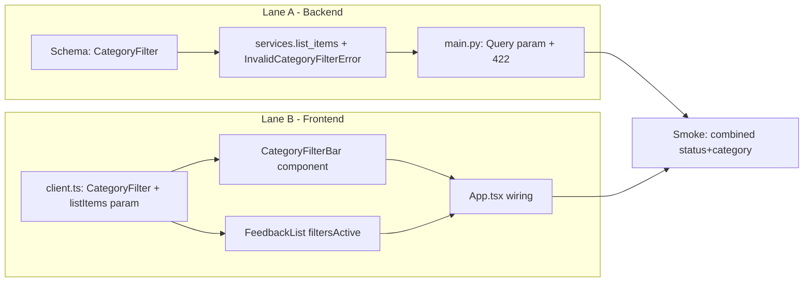

# Category Filter — Implementation Plan

> **For agents:** Follow phases in dependency order. Parallel lanes may run concurrently only where noted.
> **Spec:** [2026-06-25-category-filter-spec.md](2026-06-25-category-filter-spec.md)
> **Status:** Approved

## Goal

Add a server-side category filter to the feedback inbox, AND-combined with the existing status filter, surfaced as a button group in the UI.

## Architecture

Mirror the existing `status` filter end-to-end. The backend gains a `category` query param on `GET /api/items` that `list_items` validates and applies; invalid values map to HTTP 422 exactly as the status filter does. The frontend adds a `CategoryFilterBar` modeled on `StatusFilterBar`, with `App.tsx` holding a second filter in state and passing both to `listItems`. `FeedbackList` gains a `filtersActive` prop to show a distinct empty message. The `FeedbackItem` model, create flow, and review flow stay unchanged.

## Dependency graph

| Lane | Tasks | Can run in parallel with |
|------|-------|--------------------------|
| A | Backend (Tasks 1-2) | Lane B (contract is the agreed query param) |
| B | Frontend (Tasks 3-5) | Lane A |

## Reuse checklist (anti-bloat)

- [ ] Reuse `Category` literal / `CATEGORIES` tuple already defined in `app/schemas.py` and `app/models.py` — do not redefine the category set.
- [ ] Extend `list_items` rather than adding a parallel query function; mirror the existing `status` branch.
- [ ] `CategoryFilterBar` mirrors `StatusFilterBar` structure (role="group", active class) rather than inventing a new pattern.
- [ ] No new backend or frontend dependency.

---

## Task 1: Backend service + schema (TDD)

**Files:**
- Modify: `app/schemas.py`, `app/services.py`
- Test: `tests/test_services.py`

**Depends on:** none
**Parallel with:** Task 3 (frontend)

- [ ] RED: add `test_list_items_filters_by_category` (filter by one category; combined status+category) and an invalid-category test expecting `InvalidCategoryFilterError`.
- [ ] Add `CategoryFilter = Literal["bug", "idea", "process", "other", "all"]` to `app/schemas.py`.
- [ ] Add `InvalidCategoryFilterError` to `app/services.py`.
- [ ] Extend `list_items(db, status="all", category="all")`: validate `category`; when `!= "all"`, add `.filter(FeedbackItem.category == category)`. Preserve `created_at desc` ordering and status filtering.

**Verify:** `pytest tests/test_services.py -v`

---

## Task 2: API endpoint (TDD)

**Files:**
- Modify: `app/main.py`
- Test: `tests/test_api.py`

**Depends on:** Task 1

- [ ] RED: add a test for `GET /api/items?category=bug` and one asserting an invalid category returns 422.
- [ ] Add `category: CategoryFilter = Query(default="all")` to `get_items`; pass to `list_items`; map `InvalidCategoryFilterError` -> `HTTPException(status_code=422)` (mirror `InvalidStatusFilterError`).

**Verify:** `pytest tests/test_api.py -v` then `pytest` and `ruff check .`

---

## Task 3: API client (TDD)

**Files:**
- Modify: `frontend/src/api/client.ts`
- Test: `frontend/src/api/client.test.ts`

**Depends on:** none
**Parallel with:** Task 1

- [ ] RED: assert `listItems` includes the `category` param in the request URL.
- [ ] Add `export type CategoryFilter = Category | "all";`.
- [ ] Change `listItems(status = "all", category = "all")` to build `/api/items?status=${status}&category=${category}`.

**Verify:** `npm run test` (in `frontend/`)

---

## Task 4: CategoryFilterBar + FeedbackList empty state (TDD)

**Files:**
- Create: `frontend/src/components/CategoryFilterBar.tsx`, `frontend/src/components/CategoryFilterBar.test.tsx`
- Modify: `frontend/src/components/FeedbackList.tsx`, `frontend/src/components/FeedbackList.test.tsx`

**Depends on:** Task 3

- [ ] RED: `CategoryFilterBar` renders All categories / Bug / Idea / Process / Other, marks active, calls onChange. `FeedbackList` shows "No feedback matches these filters." when empty and `filtersActive` is true, else "No feedback items yet."
- [ ] Build `CategoryFilterBar` mirroring `StatusFilterBar` (role="group", aria-label="Filter by category").
- [ ] Add `filtersActive?: boolean` prop to `FeedbackList`; branch the empty message.

**Verify:** `npm run test` (in `frontend/`)

---

## Task 5: App wiring

**Files:**
- Modify: `frontend/src/App.tsx`
- Test: `frontend/src/App.test.tsx`

**Depends on:** Tasks 3, 4

- [ ] Add `categoryFilter` state; `loadItems(status, category)`; include `categoryFilter` in `useEffect` deps and in `handleCreate`/`handleReview` reloads.
- [ ] Render `<CategoryFilterBar>` next to `<StatusFilterBar>`; pass `filtersActive = statusFilter !== "all" || categoryFilter !== "all"` to `FeedbackList`.

**Verify:** `npm run test` and `npm run lint` (in `frontend/`)

---

## Verification (pre-PR)

| Check | Command / action |
|-------|------------------|
| Backend tests | `pytest` (repo root) |
| Backend lint | `ruff check .` |
| Frontend tests | `npm run test` (in `frontend/`) |
| Frontend lint | `npm run lint` (in `frontend/`) |
| Smoke | API on :8000 (seeded) + UI on :5173; verify combined status+category filtering and filtered-empty message; see `docs/features/2026-06-25-category-filter-smoke.md` |

## Doc updates required

- [ ] Update `AGENTS.md` API surface row for `GET /api/items` to note the `category` query param.
- [ ] Append any learnings to `context/` (Phase 8 retro consolidates).
